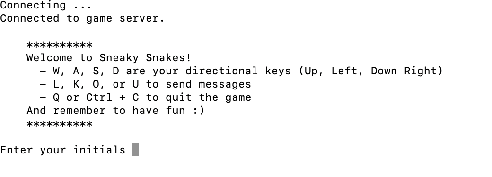
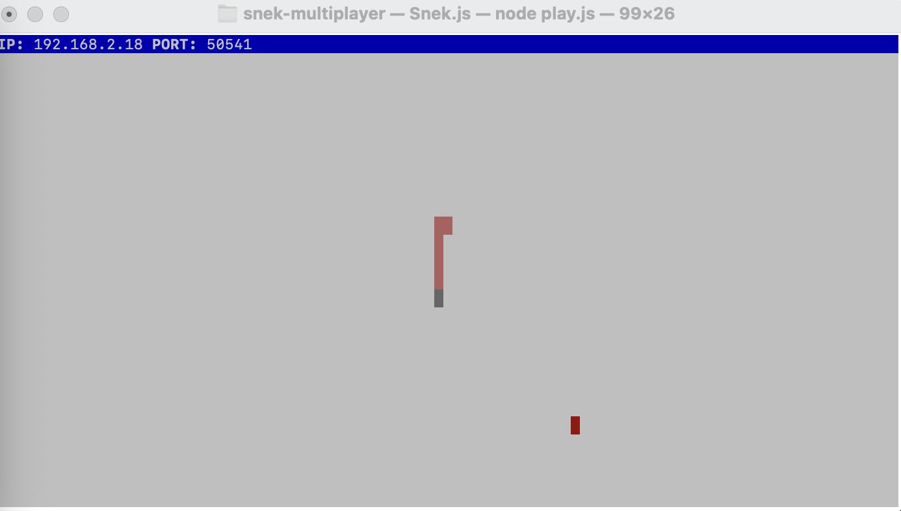
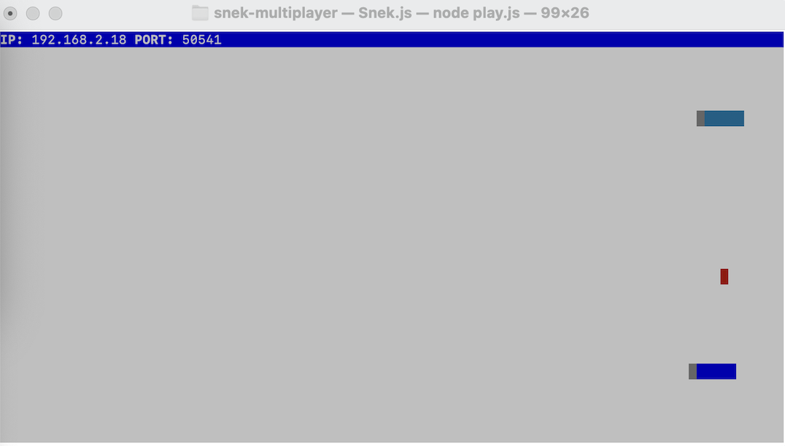
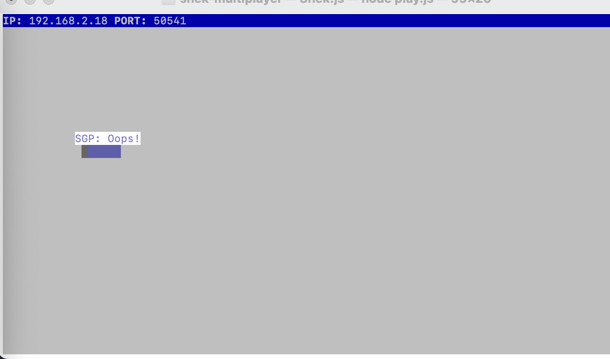

# Sneaky Snakes

Snake game is a very popular video game. It is a video game concept where the player maneuvers a dot and grows it by ‘eating’ pieces of food. As it moves and eats, it grows and the growing snake becomes an obstacle to smooth maneuvers. The goal is to grow it to become as big as possible without bumping into the side walls, or bumping into itself, upon which it dies.

This is simply a multiplayer take on the genre.

Before you can run this client, you will need to be running the server side which you can download and install from [here](https://github.com/lighthouse-labs/snek-multiplayer). 

## Final Product

> When connected, the player is greeted with instructions on how to play.

> The player's snake shows up in the server window

> Multiple players can connect at once

> Some keybindings cause messages to appear

## Getting Started

- Follow steps inside the snek server repo to run the server side
- Install dependencies  in the snake client with `npm i`
- Run the development snake client using the `node play.js` command.
- Enter your initials when prompted
- Play the game, use `W, A, S, D` to move up, left, down, and right
- Send pre-set messages using `L, K, O, and U`